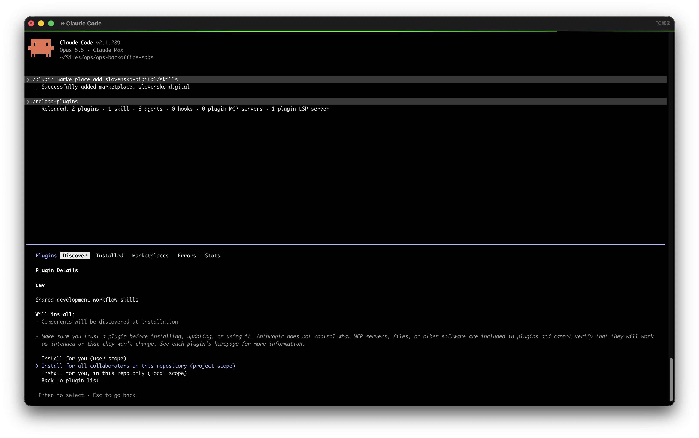

# skills

Shared development skills for AI coding agents.

| Skill | What it does |
| --- | --- |
| `prepare-pr-for-review` | Opens or updates a GitHub PR with a "The problem / Solution / Demo" description |

## Install

### Claude Code (plugin)

Run these inside a Claude Code session (start it with `claude`), not in your shell:

```
/plugin marketplace add slovensko-digital/skills
/plugin install dev@slovensko-digital
```

Then just ask "open a PR", or run `/dev:prepare-pr-for-review`.
Update with `/plugin marketplace update slovensko-digital`.

#### Install for all collaborators on a repo

To get it suggested automatically to everyone working on a repo, run `/plugin` inside that repo, open `dev` in the Discover tab and choose **Install for all collaborators on this repository (project scope)**:



This writes the plugin to the repo's `.claude/settings.json`. Commit that file. Collaborators are then asked to install the plugin when they trust the repo's folder in Claude Code.

You can also add it to `.claude/settings.json` by hand:

```json
{
  "extraKnownMarketplaces": {
    "slovensko-digital": { "source": { "source": "github", "repo": "slovensko-digital/skills" } }
  },
  "enabledPlugins": { "dev@slovensko-digital": true }
}
```

### Claude Code without the `dev:` prefix, or other agents (Codex, Copilot, Cursor, ...)

Clone the repo and symlink the skill into your agent's skills folder:

```
git clone git@github.com:slovensko-digital/skills.git ~/Sites/slovensko-digital/skills
ln -s ~/Sites/slovensko-digital/skills/skills/prepare-pr-for-review ~/.claude/skills/prepare-pr-for-review
```

Use the skills folder of your agent instead of `~/.claude/skills`. Update with `git pull`.

## Add or change a skill

1. Add or edit `skills/<skill-name>/SKILL.md` (frontmatter with `name` and `description`, then instructions). Supporting files go in the same folder.
2. Add new skills to the table above.
3. Bump `version` in `.claude-plugin/plugin.json`, otherwise installed plugins won't pick up the change.
4. Validate and try it out:

   ```
   claude plugin validate .
   claude --plugin-dir .
   ```

   The second command starts Claude Code with the plugin loaded from your working copy, so you can test the skill before pushing.
5. Open a PR. This repo uses its own `prepare-pr-for-review` skill via the symlink in `.claude/skills/`, so just ask Claude to "open a PR".

To use a new skill in this repo too, symlink it: `ln -s ../../skills/<skill-name> .claude/skills/<skill-name>`.
